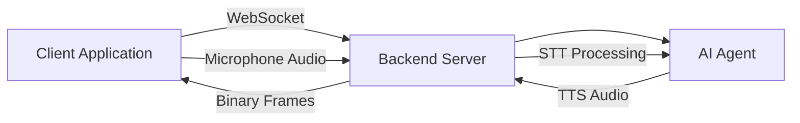

## Overview

The WebSocket channel provides a lightweight alternative to WebRTC for streaming audio to and from Iqra AI agents. WebSocket integration is ideal for:

- Custom telephony integrations
- Browser applications without WebRTC support
- Server-to-server audio streaming
- IoT devices with limited codec support
- Simplified deployment without peer-to-peer negotiation

Unlike WebRTC, WebSocket uses a **client-server model** with direct binary audio streaming over a persistent TCP connection.

## Architecture

### Connection model



**Key difference from WebRTC**: WebSocket is a simple bidirectional channel without SDP negotiation, ICE candidates, or RTP encapsulation.

### Transport implementation

The `WebSocketClientTransport` handles both text and binary messages:

- **Binary messages**: Raw audio frames (PCM, μ-law, A-law, etc.)
- **Text messages**: Control signals, metadata, transcripts

**Implementation**: `IqraInfrastructure/Managers/Conversation/Session/Client/Transport/WebSocketClientTransport.cs:8`

## Session initialization

<Steps>
  <Step title="Request web session">
    Client initiates a session with `transportType: 'WebSocket'`:

    ```javascript
    const response = await fetch('/api/websession/initiate', {
      method: 'POST',
      headers: { 'Content-Type': 'application/json' },
      body: JSON.stringify({
        businessId: 12345,
        campaignId: 'campaign-abc',
        transportType: 'WebSocket',  // Specify WebSocket
        clientIdentifier: 'user-session-xyz',
        audioConfig: {
          input: {
            codec: 'PCMU',
            sampleRate: 8000,
            bitsPerSample: 16,
            channels: 1
          },
          output: {
            codec: 'PCMU',
            sampleRate: 8000,
            bitsPerSample: 16,
            channels: 1,
            frameDurationMs: 20
          }
        }
      })
    });

    const { websocketUrl } = await response.json();
    // websocketUrl: wss://backend.example.com/ws/session/{sessionId}/websocket/{clientId}/{token}
    ```
  </Step>

  <Step title="Connect WebSocket">
    Establish WebSocket connection to the provided URL:

    ```javascript
    const ws = new WebSocket(websocketUrl);
    ws.binaryType = 'arraybuffer';  // Important for audio data

    ws.onopen = () => {
      console.log('WebSocket connected');
      // Connection ready, conversation will start
    };
    ```
  </Step>

  <Step title="Backend activates transport">
    When the WebSocket connects, backend activates the deferred transport:

    ```csharp
    var readWebSocketTransport = new WebSocketClientTransport(
        webSocket,
        loggerFactory.CreateLogger<WebSocketClientTransport>(),
        sessionOverallCts.Token
    );
    deferredTransport.Activate(readWebSocketTransport);
    
    // Start conversation
    if (sessionManager.State == ConversationSessionState.WaitingForPrimaryClient) {
        await sessionManager.NotifyConversationStarted();
    }
    ```

    **Source**: `IqraInfrastructure/Managers/WebSession/BackendWebSessionProcessorManager.cs:271`
  </Step>

  <Step title="Conversation begins">
    AI agent starts speaking, and audio flows bidirectionally through the WebSocket.
  </Step>
</Steps>

## Audio streaming

### Sending audio (Client → Backend)

Stream microphone audio as binary WebSocket frames:

```javascript
// Capture audio from microphone
const audioContext = new AudioContext({ sampleRate: 8000 });
const stream = await navigator.mediaDevices.getUserMedia({ audio: true });
const source = audioContext.createMediaStreamSource(stream);

// Process audio with ScriptProcessor or AudioWorklet
const processor = audioContext.createScriptProcessor(160, 1, 1); // 20ms at 8kHz

processor.onaudioprocess = (e) => {
  const inputData = e.inputBuffer.getChannelData(0);
  
  // Convert Float32Array to Int16 PCM
  const pcm16 = new Int16Array(inputData.length);
  for (let i = 0; i < inputData.length; i++) {
    const s = Math.max(-1, Math.min(1, inputData[i]));
    pcm16[i] = s < 0 ? s * 0x8000 : s * 0x7FFF;
  }
  
  // Send as binary WebSocket message
  if (ws.readyState === WebSocket.OPEN) {
    ws.send(pcm16.buffer);
  }
};

source.connect(processor);
processor.connect(audioContext.destination);
```

### Receiving audio (Backend → Client)

Play AI agent's voice from binary frames:

```javascript
const audioQueue = [];
let isPlaying = false;

ws.onmessage = (event) => {
  if (event.data instanceof ArrayBuffer) {
    // Binary audio frame
    const pcm16 = new Int16Array(event.data);
    
    // Convert to Float32 for Web Audio API
    const float32 = new Float32Array(pcm16.length);
    for (let i = 0; i < pcm16.length; i++) {
      float32[i] = pcm16[i] / (pcm16[i] < 0 ? 0x8000 : 0x7FFF);
    }
    
    audioQueue.push(float32);
    
    if (!isPlaying) {
      playAudioQueue();
    }
  } else {
    // Text message (metadata, transcripts, etc.)
    const message = JSON.parse(event.data);
    handleTextMessage(message);
  }
};

function playAudioQueue() {
  if (audioQueue.length === 0) {
    isPlaying = false;
    return;
  }
  
  isPlaying = true;
  const audioData = audioQueue.shift();
  
  const audioBuffer = audioContext.createBuffer(1, audioData.length, 8000);
  audioBuffer.getChannelData(0).set(audioData);
  
  const source = audioContext.createBufferSource();
  source.buffer = audioBuffer;
  source.connect(audioContext.destination);
  source.onended = () => playAudioQueue();
  source.start();
}
```

### Backend audio handling

The backend transport processes both directions:

```csharp
private async Task StartReceiveLoopAsync(CancellationToken cancellationToken) {
    var buffer = new ArraySegment<byte>(new byte[8192]);
    
    while (_webSocket.State == WebSocketState.Open && 
           !cancellationToken.IsCancellationRequested) {
        
        var result = await _webSocket.ReceiveAsync(buffer, cancellationToken);
        
        switch (result.MessageType) {
            case WebSocketMessageType.Binary when result.Count > 0:
                // Extract audio data
                var binaryData = new byte[result.Count];
                Array.Copy(buffer.Array!, buffer.Offset, binaryData, 0, result.Count);
                
                // Pass to AI agent for STT processing
                BinaryMessageReceived?.Invoke(this, binaryData);
                break;
                
            case WebSocketMessageType.Text when result.Count > 0:
                // Handle text messages
                var textData = Encoding.UTF8.GetString(
                    buffer.Array!, buffer.Offset, result.Count
                );
                TextMessageReceived?.Invoke(this, textData);
                break;
                
            case WebSocketMessageType.Close:
                // Client disconnected
                Disconnected?.Invoke(this, 
                    result.CloseStatusDescription ?? "WebSocket closed"
                );
                return;
        }
    }
}
```

**Source**: `IqraInfrastructure/Managers/Conversation/Session/Client/Transport/WebSocketClientTransport.cs:32`

### Sending audio from backend

```csharp
public async Task SendBinaryAsync(
    byte[] data, 
    int sampleRate, 
    int bitsPerSample, 
    int frameDurationMs, 
    CancellationToken cancellationToken
) {
    if (_webSocket.State != WebSocketState.Open) {
        _logger.LogWarning("Attempted to send on non-open WebSocket");
        return;
    }
    
    await _webSocket.SendAsync(
        new ArraySegment<byte>(data), 
        WebSocketMessageType.Binary, 
        endOfMessage: true, 
        cancellationToken
    );
}
```

**Source**: `IqraInfrastructure/Managers/Conversation/Session/Client/Transport/WebSocketClientTransport.cs:85`

## Audio format configuration

### Session configuration

Specify audio encoding in the session request:

```json
{
  "transportType": "WebSocket",
  "audioConfig": {
    "input": {
      "codec": "PCMU",
      "sampleRate": 8000,
      "bitsPerSample": 16,
      "channels": 1
    },
    "output": {
      "codec": "PCMU",
      "sampleRate": 8000,
      "bitsPerSample": 16,
      "channels": 1,
      "frameDurationMs": 20
    }
  }
}
```

### Supported codecs

<Tabs>
  <Tab title="PCMU (μ-law)">
    **G.711 μ-law encoding** - Standard for North American telephony

    - **Sample rate**: 8000 Hz
    - **Bitrate**: 64 kbps
    - **Frame size**: 160 samples @ 20ms
    - **Use case**: Telephony integration, VoIP

    ```javascript
    // μ-law encoding (if needed client-side)
    function encodeMuLaw(sample) {
      const BIAS = 0x84;
      const CLIP = 32635;
      
      let sign = (sample >> 8) & 0x80;
      if (sign) sample = -sample;
      if (sample > CLIP) sample = CLIP;
      sample += BIAS;
      
      let exponent = Math.floor(Math.log(sample) / Math.log(2)) - 7;
      let mantissa = (sample >> (exponent + 3)) & 0x0F;
      let mulaw = ~(sign | (exponent << 4) | mantissa);
      
      return mulaw & 0xFF;
    }
    ```
  </Tab>

  <Tab title="PCMA (A-law)">
    **G.711 A-law encoding** - Standard for European telephony

    - **Sample rate**: 8000 Hz
    - **Bitrate**: 64 kbps
    - **Frame size**: 160 samples @ 20ms
    - **Use case**: International telephony, PSTN
  </Tab>

  <Tab title="Linear PCM">
    **Uncompressed 16-bit PCM** - Highest quality, largest bandwidth

    - **Sample rate**: 8000, 16000, or 48000 Hz
    - **Bitrate**: 128-768 kbps (depending on sample rate)
    - **Frame size**: Variable
    - **Use case**: High-quality audio, low-latency requirements

    ```javascript
    // Send raw PCM
    const pcmData = new Int16Array(160); // 20ms @ 8kHz
    // ... fill with audio samples ...
    ws.send(pcmData.buffer);
    ```
  </Tab>

  <Tab title="OPUS">
    **Modern codec** - Best quality-to-bandwidth ratio

    - **Sample rate**: 48000 Hz
    - **Bitrate**: 6-510 kbps (adaptive)
    - **Frame size**: 120-960 samples (2.5-60ms)
    - **Use case**: Modern applications, bandwidth-constrained networks

    <Info>
    OPUS requires client-side encoding. Use libraries like opus.js or opus-encoder.
    </Info>
  </Tab>
</Tabs>

## Text messaging

WebSocket supports bidirectional text messages for control and metadata:

### Client → Backend

```javascript
// Send user metadata
ws.send(JSON.stringify({
  type: 'metadata',
  userId: 'user-12345',
  sessionData: {
    referrer: 'website',
    language: 'en-US'
  }
}));

// Send custom events
ws.send(JSON.stringify({
  type: 'event',
  name: 'button_clicked',
  data: { buttonId: 'purchase' }
}));
```

### Backend → Client

```javascript
ws.onmessage = (event) => {
  if (typeof event.data === 'string') {
    const message = JSON.parse(event.data);
    
    switch (message.type) {
      case 'transcript':
        // Display what user said
        console.log('User:', message.text);
        break;
        
      case 'agent_response':
        // Display AI agent's text response
        console.log('Agent:', message.text);
        break;
        
      case 'status':
        // Session status updates
        console.log('Status:', message.status);
        break;
        
      case 'metadata':
        // Custom metadata from agent
        handleMetadata(message.data);
        break;
    }
  }
};
```

### Backend implementation

```csharp
public async Task SendTextAsync(string text, CancellationToken cancellationToken) {
    if (_webSocket.State != WebSocketState.Open) {
        return;
    }
    
    var bytes = Encoding.UTF8.GetBytes(text);
    await _webSocket.SendAsync(
        new ArraySegment<byte>(bytes), 
        WebSocketMessageType.Text, 
        endOfMessage: true, 
        cancellationToken
    );
}
```

**Source**: `IqraInfrastructure/Managers/Conversation/Session/Client/Transport/WebSocketClientTransport.cs:95`

## Connection lifecycle

### Connection establishment

```javascript
const ws = new WebSocket(websocketUrl);

ws.onopen = (event) => {
  console.log('WebSocket connected');
  // Backend starts AI conversation automatically
};

ws.onerror = (error) => {
  console.error('WebSocket error:', error);
};

ws.onclose = (event) => {
  console.log(`WebSocket closed: ${event.code} - ${event.reason}`);
  
  if (event.code === 1000) {
    // Normal closure
    console.log('Conversation ended normally');
  } else {
    // Abnormal closure, may need to reconnect
    console.log('Connection lost');
  }
};
```

### Graceful disconnection

Client-initiated disconnect:

```javascript
function endConversation() {
  if (ws.readyState === WebSocket.OPEN) {
    ws.close(1000, 'User ended conversation');
  }
}
```

Backend-initiated disconnect:

```csharp
public async Task DisconnectAsync(string reason) {
    if (!_loopCts.IsCancellationRequested) {
        _loopCts.Cancel();
    }

    if (_webSocket.State == WebSocketState.Open || 
        _webSocket.State == WebSocketState.CloseReceived) {
        try {
            var timeout = new CancellationTokenSource(TimeSpan.FromSeconds(5));
            await _webSocket.CloseOutputAsync(
                WebSocketCloseStatus.NormalClosure, 
                reason, 
                timeout.Token
            );
        } catch (Exception ex) {
            _logger.LogWarning(ex, "Exception while closing WebSocket");
        }
    }
}
```

**Source**: `IqraInfrastructure/Managers/Conversation/Session/Client/Transport/WebSocketClientTransport.cs:106`

### Handling disconnects

```csharp
case WebSocketMessageType.Close:
    _logger.LogInformation(
        "WebSocket CLOSE frame received. Reason: {Status}", 
        result.CloseStatusDescription
    );
    Disconnected?.Invoke(this, 
        result.CloseStatusDescription ?? "WebSocket closed by remote party."
    );
    return; // Exit receive loop
```

**Source**: `IqraInfrastructure/Managers/Conversation/Session/Client/Transport/WebSocketClientTransport.cs:45`

## Security and authentication

### Token-based authentication

WebSocket URL includes an HMAC token:

```
wss://backend.example.com/ws/session/{sessionId}/websocket/{clientId}/{hmacToken}
```

Backend validates token before accepting connection:

```csharp
var validatedSessionTokenResult = CallWebsocketTokenGenerator.ValidateHmacToken(
    sessionToken,
    sessionId,
    clientId,
    _backendAppConfig.WebhookTokenSecret,
    out var validationError
);

if (!validatedSessionTokenResult) {
    // Reject connection
    await webSocket.CloseAsync(
        WebSocketCloseStatus.PolicyViolation,
        "Invalid token",
        CancellationToken.None
    );
    return;
}
```

**Source**: `IqraInfrastructure/Managers/WebSession/BackendWebSessionProcessorManager.cs:250`

### Token generation

```csharp
var generatedWebhookToken = CallWebsocketTokenGenerator.GenerateHmacToken(
    session.SessionId,
    primaryWebSocketClient.ClientId,
    TimeSpan.FromMinutes(5),  // Token expiry
    _backendAppConfig.WebhookTokenSecret
);

var webhookUrl = BuildWebhookUrl(
    regionServerData,
    session.SessionId,
    primaryWebSocketClient.ClientId,
    generatedWebhookToken,
    webSessionData.TransportType
);
```

**Source**: `IqraInfrastructure/Managers/WebSession/BackendWebSessionProcessorManager.cs:209`

<Warning>
**Token expiry**: Tokens are valid for 5 minutes by default. Client must connect within this window.
</Warning>

<Note>
**TLS encryption**: Always use `wss://` (WebSocket Secure) in production to encrypt audio and text data.
</Note>

## Server-to-server integration

WebSocket is ideal for backend services streaming audio:

### Python example

```python
import asyncio
import websockets
import json
import struct

async def stream_audio_to_iqra():
    # Initialize session
    response = requests.post('https://api.iqra.ai/websession/initiate', json={
        'businessId': 12345,
        'campaignId': 'campaign-abc',
        'transportType': 'WebSocket',
        'audioConfig': {
            'input': {'codec': 'PCMU', 'sampleRate': 8000},
            'output': {'codec': 'PCMU', 'sampleRate': 8000}
        }
    })
    
    ws_url = response.json()['websocketUrl']
    
    # Connect WebSocket
    async with websockets.connect(ws_url) as websocket:
        print('Connected to Iqra AI')
        
        # Start audio streaming
        async def send_audio():
            with open('audio.pcm', 'rb') as f:
                while True:
                    chunk = f.read(160)  # 20ms @ 8kHz
                    if not chunk:
                        break
                    await websocket.send(chunk)
                    await asyncio.sleep(0.02)  # 20ms
        
        async def receive_audio():
            async for message in websocket:
                if isinstance(message, bytes):
                    # Save AI agent audio
                    process_audio(message)
                else:
                    # Handle text messages
                    data = json.loads(message)
                    print(f"Message: {data}")
        
        # Run both directions concurrently
        await asyncio.gather(send_audio(), receive_audio())

asyncio.run(stream_audio_to_iqra())
```

### Node.js example

```javascript
const WebSocket = require('ws');
const fs = require('fs');

// Initialize session
const response = await fetch('https://api.iqra.ai/websession/initiate', {
  method: 'POST',
  headers: { 'Content-Type': 'application/json' },
  body: JSON.stringify({
    businessId: 12345,
    campaignId: 'campaign-abc',
    transportType: 'WebSocket',
    audioConfig: {
      input: { codec: 'PCMU', sampleRate: 8000 },
      output: { codec: 'PCMU', sampleRate: 8000 }
    }
  })
});

const { websocketUrl } = await response.json();

// Connect WebSocket
const ws = new WebSocket(websocketUrl);

ws.on('open', () => {
  console.log('Connected to Iqra AI');
  
  // Stream audio file
  const audioStream = fs.createReadStream('audio.pcm', {
    highWaterMark: 160  // 20ms chunks
  });
  
  audioStream.on('data', (chunk) => {
    ws.send(chunk);
  });
});

ws.on('message', (data) => {
  if (Buffer.isBuffer(data)) {
    // Binary audio from AI agent
    fs.appendFileSync('output.pcm', data);
  } else {
    // Text message
    const message = JSON.parse(data);
    console.log('Message:', message);
  }
});

ws.on('close', () => {
  console.log('Disconnected');
});
```

## Performance considerations

<Note>
**Frame size matters**: 20ms frames (160 samples @ 8kHz) balance latency and network overhead. Smaller frames = lower latency but more packet overhead.
</Note>

<Note>
**Buffering**: Implement jitter buffer on client side to smooth out network variations:

```javascript
const jitterBuffer = [];
const TARGET_BUFFER_SIZE = 3; // 3 frames = 60ms

function addToBuffer(audioFrame) {
  jitterBuffer.push(audioFrame);
  
  if (jitterBuffer.length >= TARGET_BUFFER_SIZE && !isPlaying) {
    startPlayback();
  }
}
```
</Note>

<Note>
**Backpressure**: Monitor WebSocket bufferedAmount to avoid overwhelming the connection:

```javascript
function sendAudio(data) {
  if (ws.bufferedAmount > 8192) {
    // Too much buffered, skip this frame
    console.warn('Buffer overflow, dropping frame');
    return;
  }
  ws.send(data);
}
```
</Note>

## Troubleshooting

### No audio received

**Symptom**: Connected but no audio from AI agent

**Checks**:
1. Verify `binaryType` is set to `'arraybuffer'`
2. Check audio format matches session configuration
3. Confirm `onmessage` handler processes binary messages
4. Look for errors in backend logs

### Choppy audio playback

**Symptom**: Audio plays but sounds garbled

**Solutions**:
- Implement jitter buffer
- Check network latency/packet loss
- Verify sample rate matches Web Audio Context
- Ensure audio frames are played in order

### Connection drops

**Symptom**: WebSocket closes unexpectedly

**Common causes**:
- Token expired (5 minute limit)
- Network interruption
- Backend server restart
- Session timeout

**Mitigation**:
```javascript
let reconnectAttempts = 0;
const MAX_RECONNECTS = 3;

ws.onclose = (event) => {
  if (event.code !== 1000 && reconnectAttempts < MAX_RECONNECTS) {
    reconnectAttempts++;
    console.log(`Reconnecting (${reconnectAttempts}/${MAX_RECONNECTS})...`);
    setTimeout(() => initializeSession(), 1000 * reconnectAttempts);
  }
};
```

## Comparison: WebSocket vs WebRTC

| Feature | WebSocket | WebRTC |
|---------|-----------|--------|
| **Setup complexity** | Low (just connect) | High (SDP, ICE) |
| **Connection model** | Client-server | Peer-to-peer |
| **NAT traversal** | Not needed | Requires STUN/TURN |
| **Audio encapsulation** | Raw binary frames | RTP packets |
| **Text messaging** | Native support | Data channel |
| **Browser support** | Universal | Modern browsers |
| **Latency** | 50-200ms | 20-100ms |
| **Server load** | Higher (proxies all audio) | Lower (direct P2P) |
| **Use case** | Server integrations, simple clients | Browser/mobile real-time voice |

**When to choose WebSocket**:
- Backend service integration
- Simpler client implementation
- Custom audio processing pipeline
- Text messaging is primary

**When to choose WebRTC**:
- Browser-based voice calls
- Mobile applications
- Lowest possible latency
- P2P reduces server bandwidth

## Next steps

- [WebRTC gateway](/channels/webrtc) - Browser real-time communication
- [SIP trunking](/channels/sip-trunking) - Telephony provider integration
- [Voice configuration](/integrations/tts-providers) - Configure AI voice and TTS