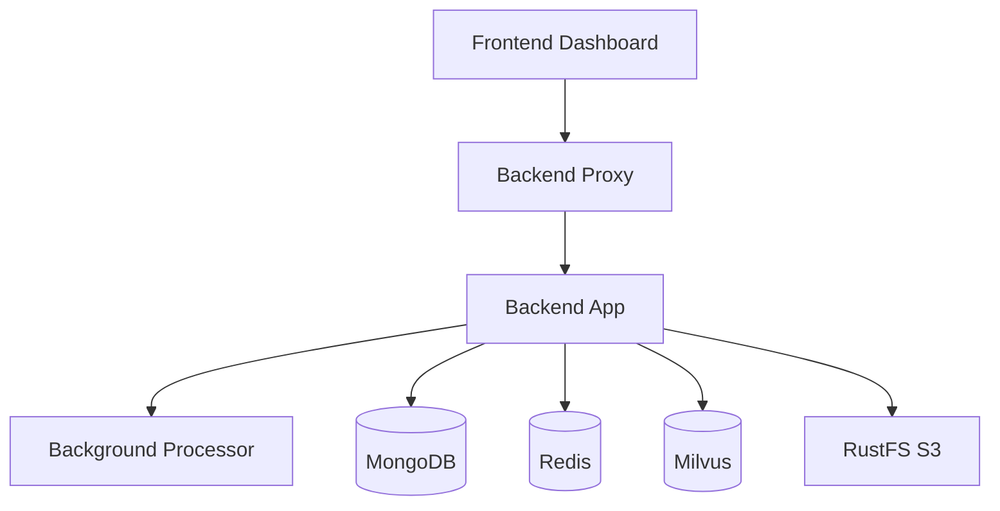

Self-hosting gives you complete control over the Iqra AI infrastructure, allowing you to run the core agent engine on your own servers while managing all dependencies and configuration.

<Warning>
  The self-hosted version excludes the commercial multi-tenant billing and whitelabeling modules. These features are only available in Iqra Cloud.
</Warning>

## Pre-release notice

<Note>
  **Version 0.1 Pending** - The codebase is currently active but requires manual service configuration. Automated database seeding scripts will be included in the official v0.1 release. Production deployment currently requires manual database setup.
</Note>

## Architecture overview

Iqra AI consists of four main services:



### Service roles

- **Frontend** - Admin dashboard and API interface
- **Backend Proxy** - Load balancer and SIP gateway
- **Backend App** - Core agent engine handling calls
- **Background Processor** - Async tasks and analytics

## Prerequisites

Before beginning installation, ensure you have:

<Steps>
  <Step title="System requirements">
    Review the [system requirements](/deployment/requirements) for hardware specifications and supported operating systems.
  </Step>
  
  <Step title="Install dependencies">
    Install all required services:
    - .NET 10 Runtime
    - MongoDB (replica set recommended)
    - Redis (cluster mode for production)
    - Milvus vector database
    - S3-compatible storage (RustFS or AWS S3)
  </Step>
  
  <Step title="Network configuration">
    Configure firewall rules and network interfaces for RTP audio (UDP) and signaling.
  </Step>
</Steps>

## Installation steps

### 1. Clone the repository

```bash
git clone https://github.com/abdofallah/IqraAI.git
cd IqraAI
```

### 2. Install .NET 10 Runtime

<Tabs>
  <Tab title="Ubuntu/Debian">
    ```bash
    wget https://dot.net/v1/dotnet-install.sh
    chmod +x dotnet-install.sh
    ./dotnet-install.sh --channel 10.0 --runtime aspnetcore
    ```
  </Tab>
  <Tab title="CentOS/RHEL">
    ```bash
    sudo dnf install dotnet-runtime-10.0
    ```
  </Tab>
  <Tab title="Windows">
    Download and install from [dotnet.microsoft.com/download/dotnet/10.0](https://dotnet.microsoft.com/download/dotnet/10.0)
  </Tab>
</Tabs>

### 3. Set up MongoDB

Iqra AI requires MongoDB for metadata storage:

```bash
# Install MongoDB
curl -fsSL https://www.mongodb.org/static/pgp/server-7.0.asc | \
   sudo gpg -o /usr/share/keyrings/mongodb-server-7.0.gpg --dearmor

echo "deb [ signed-by=/usr/share/keyrings/mongodb-server-7.0.gpg ] https://repo.mongodb.org/apt/ubuntu jammy/mongodb-org/7.0 multiverse" | \
   sudo tee /etc/apt/sources.list.d/mongodb-org-7.0.list

sudo apt-get update
sudo apt-get install -y mongodb-org

# Start MongoDB
sudo systemctl start mongod
sudo systemctl enable mongod
```

<Note>
  For production deployments, configure MongoDB as a replica set for high availability and to support transactions.
</Note>

### 4. Install Redis

```bash
# Install Redis
sudo apt-get install redis-server

# Configure Redis for production
sudo nano /etc/redis/redis.conf
# Set: maxmemory 2gb
# Set: maxmemory-policy allkeys-lru

# Start Redis
sudo systemctl start redis-server
sudo systemctl enable redis-server
```

### 5. Deploy Milvus vector database

Milvus is required for RAG (Retrieval-Augmented Generation) and knowledge base features:

```bash
# Download Milvus standalone
wget https://github.com/milvus-io/milvus/releases/download/v2.4.0/milvus-standalone-docker-compose.yml -O docker-compose.yml

# Start Milvus
docker-compose up -d
```

Milvus will be available at `http://localhost:19530`.

### 6. Configure S3 storage

<Tabs>
  <Tab title="RustFS (Recommended)">
    Deploy the RustFS S3-compatible server:
    ```bash
    # Clone RustFS
    git clone https://github.com/rustfs/rustfs.git
    cd rustfs
    
    # Build and run
    cargo build --release
    ./target/release/rustfs --data-dir /var/lib/rustfs
    ```
  </Tab>
  <Tab title="AWS S3">
    Create an S3 bucket and IAM user with appropriate permissions:
    ```json
    {
      "Version": "2012-10-17",
      "Statement": [
        {
          "Effect": "Allow",
          "Action": ["s3:*"],
          "Resource": ["arn:aws:s3:::your-bucket-name/*"]
        }
      ]
    }
    ```
  </Tab>
  <Tab title="MinIO">
    ```bash
    docker run -p 9000:9000 -p 9001:9001 \
      -e MINIO_ROOT_USER=admin \
      -e MINIO_ROOT_PASSWORD=password \
      minio/minio server /data --console-address ":9001"
    ```
  </Tab>
</Tabs>

### 7. Configure the applications

Copy and configure the settings for each service:

<Steps>
  <Step title="Frontend configuration">
    ```bash
    cd ProjectIqraFrontend
    cp appsettings.json.example appsettings.json
    nano appsettings.json
    ```
    See the [configuration reference](/deployment/configuration#frontend) for all available options.
  </Step>
  
  <Step title="Backend Proxy configuration">
    ```bash
    cd ProjectIqraBackendProxy
    cp appsettings.json.example appsettings.json
    nano appsettings.json
    ```
    Configure the server ID, region, and API key from the admin dashboard.
  </Step>
  
  <Step title="Backend App configuration">
    ```bash
    cd ProjectIqraBackendApp
    cp appsettings.json.example appsettings.json
    nano appsettings.json
    ```
    Set the network interface name for RTP audio binding.
  </Step>
  
  <Step title="Background Processor configuration">
    ```bash
    cd IqraBackgroundProcessor
    cp appsettings.json.example appsettings.json
    nano appsettings.json
    ```
    Configure MongoDB and Milvus connections.
  </Step>
</Steps>

### 8. Generate encryption keys

All services require shared encryption keys for security:

```bash
# Generate a 32-character AES key for integrations
openssl rand -base64 32

# Generate API key encryption keys
openssl rand -base64 32  # ApiKeyEncryptionKey
openssl rand -base64 32  # PayloadEncryptionKey

# Generate email hash pepper
openssl rand -base64 16

# Generate webhook token secret
openssl rand -base64 32
```

<Warning>
  Store these keys securely. Losing encryption keys will make existing data unrecoverable. The `Integrations.EncryptionKey` MUST be identical across all four services.
</Warning>

### 9. Determine network interface name

The Backend App and Proxy require the OS-level network interface name for RTP audio:

<Tabs>
  <Tab title="Linux">
    ```bash
    ip addr
    # Look for the interface with your server's IP (e.g., eth0, ens5)
    ```
  </Tab>
  <Tab title="Windows">
    ```powershell
    ipconfig
    # Note the adapter name (e.g., "Ethernet", "vEthernet (WSL)")
    ```
  </Tab>
</Tabs>

Update the `Hardware.NetworkInterfaceName` setting in all configuration files.

### 10. Build the applications

```bash
# Build all projects
dotnet build ProjectIqra.sln --configuration Release
```

### 11. Initialize the database

<Note>
  Automated seeding scripts will be included in v0.1. For now, manual database initialization is required.
</Note>

Connect to MongoDB and create the required collections and indexes manually, or wait for the v0.1 release with automated setup.

### 12. Start the services

Start each service in order:

```bash
# Start Frontend
cd ProjectIqraFrontend
dotnet run --configuration Release

# Start Backend Proxy (in new terminal)
cd ProjectIqraBackendProxy
dotnet run --configuration Release

# Start Backend App (in new terminal)
cd ProjectIqraBackendApp
dotnet run --configuration Release

# Start Background Processor (in new terminal)
cd IqraBackgroundProcessor
dotnet run --configuration Release
```

<Note>
  For production deployments, use a process manager like systemd (Linux) or create Windows Services to ensure services restart automatically.
</Note>

## Production deployment

### Using systemd (Linux)

Create service files for each component:

```ini
# /etc/systemd/system/iqra-frontend.service
[Unit]
Description=Iqra AI Frontend
After=network.target

[Service]
Type=simple
User=iqra
WorkingDirectory=/opt/iqra/ProjectIqraFrontend
ExecStart=/usr/bin/dotnet /opt/iqra/ProjectIqraFrontend/bin/Release/net10.0/ProjectIqraFrontend.dll
Restart=always
RestartSec=10
Environment=ASPNETCORE_ENVIRONMENT=Production

[Install]
WantedBy=multi-user.target
```

Enable and start the services:

```bash
sudo systemctl enable iqra-frontend iqra-proxy iqra-backend iqra-processor
sudo systemctl start iqra-frontend iqra-proxy iqra-backend iqra-processor
```

### Using Docker Compose

<Note>
  Official Docker images will be available with the v0.1 release. For now, build custom images from the source.
</Note>

### Load balancing and high availability

For production deployments:

1. **Deploy multiple Backend App instances** across different regions
2. **Use a reverse proxy** (Nginx, Caddy) in front of the Frontend
3. **Configure MongoDB replica sets** for database redundancy
4. **Use Redis Cluster** instead of standalone Redis
5. **Deploy Milvus in distributed mode** for large-scale vector operations

## Monitoring and maintenance

### Health checks

Each service exposes health check endpoints:

- Frontend: `http://localhost:5000/health`
- Backend Proxy: `http://localhost:5001/health`
- Backend App: `http://localhost:5002/health`
- Background Processor: `http://localhost:5003/health`

### Log management

Configure logging in `appsettings.json`:

```json
{
  "Logging": {
    "LogLevel": {
      "Default": "Information",
      "Microsoft.AspNetCore": "Warning"
    }
  }
}
```

For production, integrate with centralized logging:
- **ELK Stack** (Elasticsearch, Logstash, Kibana)
- **Grafana Loki**
- **Datadog**
- **CloudWatch** (AWS)

### Backup strategy

<Steps>
  <Step title="MongoDB backups">
    ```bash
    # Daily automated backups
    mongodump --uri="mongodb://localhost:27017" --out=/backups/$(date +%Y%m%d)
    ```
  </Step>
  
  <Step title="Redis persistence">
    Enable RDB snapshots and AOF in `redis.conf`:
    ```
    save 900 1
    appendonly yes
    ```
  </Step>
  
  <Step title="S3 versioning">
    Enable versioning on your S3 bucket to prevent accidental deletions.
  </Step>
  
  <Step title="Configuration backup">
    Version control all `appsettings.json` files (excluding secrets) in a private repository.
  </Step>
</Steps>

## Troubleshooting

### Services fail to start

Check the logs for errors:
```bash
journalctl -u iqra-frontend -n 50
```

Common issues:
- Incorrect database connection strings
- Missing encryption keys
- Network interface name mismatch
- Port conflicts

### Audio quality issues

RTP audio problems are often related to:
- Incorrect network interface configuration
- Firewall blocking UDP traffic
- Insufficient bandwidth allocation
- Network jitter or packet loss

### High memory usage

Optimize Redis and Milvus memory:
```bash
# Limit Redis memory
redis-cli CONFIG SET maxmemory 2gb

# Adjust Milvus cache size in milvus.yaml
```

## Updating

To update to a new version:

```bash
# Pull latest changes
git pull origin main

# Rebuild applications
dotnet build ProjectIqra.sln --configuration Release

# Restart services
sudo systemctl restart iqra-*
```

<Warning>
  Always backup your database before updating. Review the changelog for breaking changes and migration steps.
</Warning>

## Next steps

<CardGroup cols={2}>
  <Card title="Configuration reference" icon="gear" href="/deployment/configuration">
    Detailed documentation for all configuration options
  </Card>
  <Card title="System requirements" icon="server" href="/deployment/requirements">
    Hardware sizing and capacity planning guidance
  </Card>
  <Card title="Security best practices" icon="shield" href="/security">
    Harden your self-hosted deployment
  </Card>
  <Card title="Contributing" icon="code-pull-request" href="https://github.com/abdofallah/IqraAI/blob/master/CONTRIBUTING.md">
    Contribute to the open-source project
  </Card>
</CardGroup>